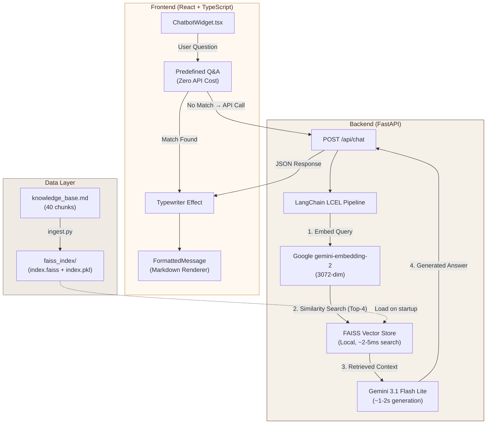

<div align="center">

# 🧠 Dx9029 — AI Portfolio with RAG Chatbot

**A modern full-stack portfolio website featuring an AI-powered RAG (Retrieval-Augmented Generation) chatbot assistant.**

Built by **Dương Quốc Vinh** · AI Engineering Senior Student @ TDTU

[](https://react.dev)
[](https://typescriptlang.org)
[](https://fastapi.tiangolo.com)
[](https://langchain.com)
[](https://ai.google.dev)
[](https://github.com/facebookresearch/faiss)

</div>

---

## 📌 Overview

This project is not just a portfolio website — it's a **full-stack AI application** that demonstrates end-to-end engineering from frontend UI to backend RAG pipeline.

Visitors (recruiters, employers, collaborators) can interact with the **Dx9029 AI chatbot** to ask questions about my background, skills, projects, and experience in **both English and Vietnamese**, receiving accurate, context-grounded answers powered by semantic retrieval and LLM generation.

### 🎯 Key Highlights

| Feature | Description |
|---|---|
| **RAG Chatbot** | Custom Retrieval-Augmented Generation system with semantic search over portfolio knowledge base |
| **Bilingual Support** | Automatically detects and responds in English or Vietnamese |
| **~5s Response Time** | Optimized from ~42s through architecture iteration (see [Optimization Journey](#-optimization-journey)) |
| **Zero-Token Q&A** | 4 predefined answers for common questions — no API calls needed |
| **Typewriter Effect** | Progressive character-by-character response rendering for natural UX |
| **Cappuccino Theme** | Warm editorial design system with glassmorphism and micro-animations |

---

## 🏗️ System Architecture



### RAG Pipeline Flow

```
User Question
    │
    ▼
┌─────────────────────────────────┐
│  1. EMBED — gemini-embedding-2  │  Google API (~150-200ms)
│     Query → 3072-dim vector     │
└──────────────┬──────────────────┘
               │
               ▼
┌─────────────────────────────────┐
│  2. RETRIEVE — FAISS (Local)    │  Cosine Similarity (~2-5ms)
│     Top-4 relevant chunks       │
└──────────────┬──────────────────┘
               │
               ▼
┌─────────────────────────────────┐
│  3. AUGMENT — System Prompt     │  Context + Rules + Question
│     + Retrieved Context         │
└──────────────┬──────────────────┘
               │
               ▼
┌─────────────────────────────────┐
│  4. GENERATE — Gemini 3.1      │  Flash Lite LLM (~1-2s)
│     Context-aware Answer        │
└─────────────────────────────────┘
```

---

## 🛠️ Tech Stack

### Frontend
| Technology | Purpose |
|---|---|
| **React 18** + **TypeScript** | Component-based UI with type safety |
| **Vite** | Lightning-fast HMR & optimized builds |
| **Tailwind CSS** | Utility-first styling with custom Cappuccino design tokens |
| **Framer Motion** | Spring-physics animations & page transitions |
| **Lucide React** | Consistent icon system |

### Backend (RAG Microservice)
| Technology | Purpose |
|---|---|
| **FastAPI** + **Uvicorn** | Async Python API server with auto-docs |
| **LangChain LCEL** | Composable RAG pipeline orchestration |
| **Gemini 3.1 Flash Lite** | Low-latency LLM for response generation |
| **Google gemini-embedding-2** | 3072-dim text embeddings via API |
| **FAISS** (facebook/faiss) | Local vector similarity search (~2-5ms) |

### Infrastructure
| Technology | Purpose |
|---|---|
| **GitHub Pages** | Frontend static hosting |
| **Render** | Backend deployment (Python Web Service) |
| **GitHub Actions** | CI/CD pipeline |

---

## 📁 Project Structure

```
Portfolio/
├── run_dev.bat                    # 🚀 One-click dev launcher (venv + pip + servers)
├── package.json                   # Frontend dependencies & scripts
├── vite.config.ts                 # Vite configuration (port 3000)
├── tailwind.config.ts             # Cappuccino design token system
│
├── src/                           # ── Frontend Source ──
│   ├── App.tsx                    # Root layout & section composition
│   ├── components/
│   │   ├── ChatbotWidget.tsx      # 🤖 RAG Chatbot (core feature)
│   │   │                          #    ├── FormattedMessage — Markdown renderer
│   │   │                          #    ├── PREDEFINED_QA — Zero-token answers
│   │   │                          #    ├── Typewriter effect — Progressive reveal
│   │   │                          #    └── Expand/Collapse panel toggle
│   │   ├── Hero.tsx               # Landing hero with animated CTA
│   │   ├── About.tsx              # Profile & experience cards
│   │   ├── ProjectCard.tsx        # Interactive project showcase
│   │   ├── Skills.tsx             # Categorized skills grid
│   │   ├── Experience.tsx         # Professional timeline
│   │   ├── Certificates.tsx       # Certificate gallery + modal viewer
│   │   ├── Contact.tsx            # Contact section (Email, Zalo, Phone)
│   │   └── Navbar.tsx             # Floating scroll-aware navigation
│   ├── data/                      # Static portfolio content (JSON)
│   │   ├── projects.json
│   │   ├── certificates.json
│   │   ├── experience.json
│   │   └── skills.json
│   └── styles/
│       ├── index.css              # Global styles & Tailwind directives
│       └── theme.css              # Cappuccino color token definitions
│
└── backend/                       # ── RAG Backend Microservice ──
    ├── requirements.txt           # Python dependencies
    ├── .env                       # API keys (GOOGLE_API_KEY only)
    ├── data/
    │   ├── knowledge_base.md      # 📚 Portfolio knowledge base (~10K chars)
    │   └── faiss_index/           # 📦 Local vector DB (committed to Git)
    │       ├── index.faiss        #    FAISS binary index file
    │       └── index.pkl          #    Document metadata store
    └── app/
        ├── main.py                # FastAPI app, CORS, endpoints
        ├── config.py              # Environment config & validation
        ├── rag_engine.py          # RAG pipeline (Embed → Search → Generate)
        └── ingest.py              # Knowledge base → FAISS index builder
```

---

## 🔄 Optimization Journey

A key engineering story — how I **reduced response latency by 88%** through iterative architecture decisions:

| Version | Embedding | Vector DB | LLM | Latency |
|---|---|---|---|---|
| **v1** (Initial) | `all-MiniLM-L6-v2` (local CPU) | Pinecone (cloud) | Gemini 3.6 Flash | **~42s** |
| **v2** (API Embed) | Google `text-embedding-004` (API) | Pinecone (cloud) | Gemini 3.6 Flash | ~15s |
| **v3** (Fast LLM) | Google `gemini-embedding-2` (API) | Pinecone (cloud) | Gemini 3.1 Flash Lite | ~11s |
| **v4** (Local DB) | Google `gemini-embedding-2` (API) | **FAISS (local)** | Gemini 3.1 Flash Lite | **~3-5s** ✅ |

### What I Learned
- **Local CPU embedding is the bottleneck** — `all-MiniLM-L6-v2` on CPU took ~10s cold start + 1-3s per query. Switching to Google Embedding API eliminated this entirely.
- **Cloud vector DB adds unnecessary latency** — For a small knowledge base (~40 chunks), network round-trips to Pinecone (~200-300ms) are wasteful. Local FAISS searches in **~2-5ms**.
- **LLM model selection matters** — `gemini-3.1-flash-lite` is purpose-built for low-latency applications and produces comparable quality at much lower response time.
- **Async is critical** — Switching from `chain.invoke()` to `chain.ainvoke()` prevents blocking FastAPI's event loop during LLM generation.

---

## 🚀 Quick Start

### Method 1: One-Click Script (Windows)

```cmd
.\run_dev.bat
```

This automatically handles: venv creation → pip install → npm install → FastAPI server (port 8000) → Vite dev server (port 3000).

### Method 2: Manual Setup

#### Backend
```bash
cd backend
python -m venv venv
.\venv\Scripts\activate          # Windows
pip install -r requirements.txt

# Build local FAISS vector index (required on first run):
python -m app.ingest

# Start API server:
uvicorn app.main:app --reload --port 8000
```

#### Frontend
```bash
# In project root:
npm install
npm run dev
```

Open **http://localhost:3000** → click the chatbot avatar (bottom-right corner).

---

## 🔑 Environment Variables

Create `backend/.env`:

```env
GOOGLE_API_KEY=your_google_api_key
GEMINI_MODEL=gemini-3.1-flash-lite
EMBEDDING_MODEL=models/gemini-embedding-2
```

> **Note:** Only a Google API key is required. No Pinecone or third-party vector DB credentials needed — FAISS runs entirely local.

---

## 🌐 Deployment

| Layer | Platform | Command |
|---|---|---|
| **Frontend** | GitHub Pages | `npm run deploy-gh` |
| **Backend** | Render | `uvicorn app.main:app --host 0.0.0.0 --port $PORT` |

Set `VITE_API_URL` to the Render backend URL in the GitHub Pages build environment.

---

## 🤖 Chatbot Features

- **Semantic Search**: Understands meaning, not just keywords — "What can Vinh do?" retrieves skills, projects, and experience.
- **Bilingual**: Automatically responds in the same language as the question (Vietnamese ↔ English).
- **Markdown Formatting**: Responses render with **bold**, *italic*, `• bullet points`, and [clickable links](https://example.com).
- **Predefined Q&A**: 4 common questions answered instantly without API calls (zero token cost).
- **Typewriter Animation**: Characters appear progressively for a natural, engaging feel.
- **Expandable Panel**: Toggle between compact (380px) and wide (680px) chat window.

---

## 📬 Contact

| | |
|---|---|
| **Developer** | Dương Quốc Vinh (Dx9029) |
| **Role** | AI Engineering Senior Student — Ton Duc Thang University |
| **Email** | [duongquocvinh9029@gmail.com](mailto:duongquocvinh9029@gmail.com) |
| **LinkedIn** | [Dương Quốc Vinh](https://www.linkedin.com/in/d%C6%B0%C6%A1ng-qu%E1%BB%91c-vinh-619b51412/) |
| **GitHub** | [github.com/vinh9029](https://github.com/vinh9029) |
| **Zalo** | `0559149285` |

---

<div align="center">

**Built with ☕ and AI by Dx9029**

</div>
